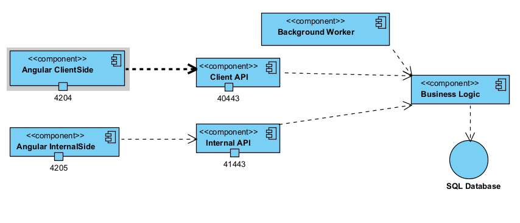
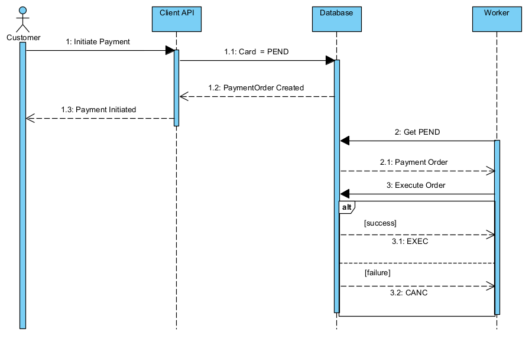
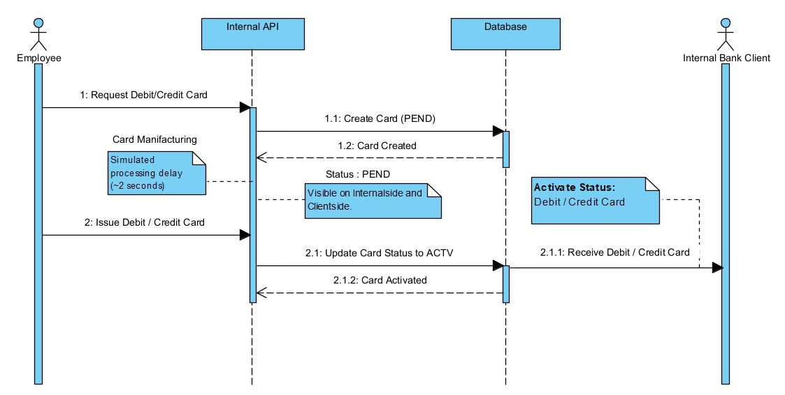
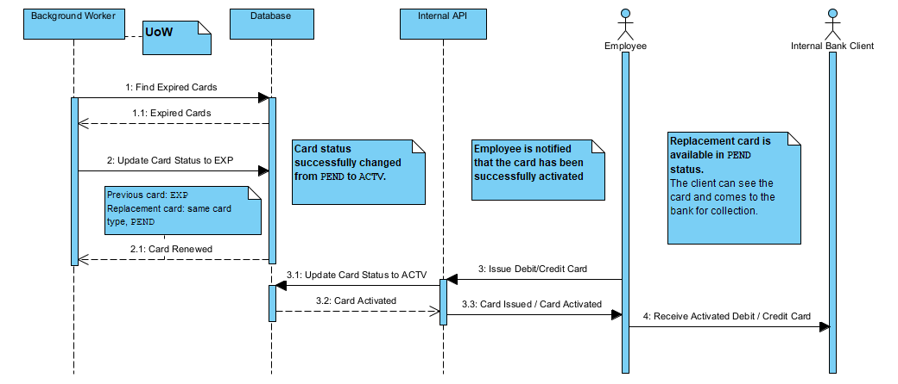
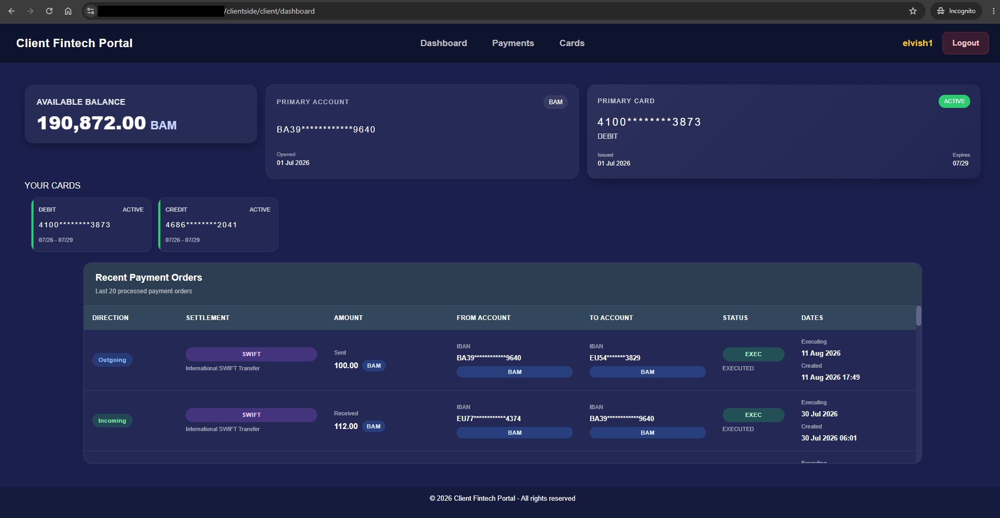
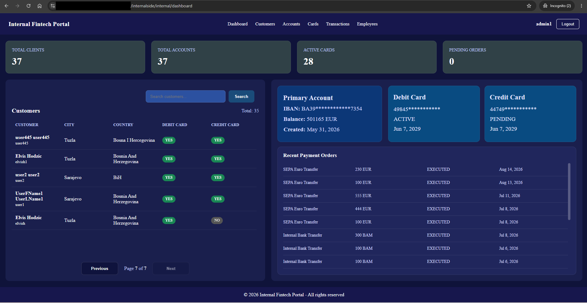

# FinTech Banking Platform

## Overview
# FinTech Banking Application

## Overview

This project is a self-developed **FinTech banking application** built around banking-domain experience, with the goal of demonstrating how real-world banking business processes can be modeled and connected through a modern web architecture.

The system is organized into two separate applications, each serving a different type of banking user:

* **Clientside** — an electronic banking application designed for end customers.
* **Internalside** — an internal banking application designed for bank employees.

Both applications are part of the same banking platform and work with the underlying banking data and business processes, while their functionality, user experience, and access rights are separated according to the type of user.

The frontend applications are implemented as **Angular SPAs**, while the backend layer is implemented with **ASP.NET Core and C# REST APIs**, providing authentication, authorization, data access, and execution of the underlying banking business logic.

The system also includes a **Background Worker** responsible for asynchronous and scheduled business processes, including Payment Order processing and the card renewal lifecycle.

Security and data protection are considered throughout the application. Sensitive information such as **IBANs and card numbers is masked on the backend before being returned to the frontend applications**, ensuring that protected data is not unnecessarily exposed to users.

The purpose of the project goes beyond demonstrating a user interface. It demonstrates how banking business processes can be modeled and integrated across the **Angular frontend, ASP.NET Core APIs, database, authentication and authorization mechanisms, and background processing** into a complete FinTech application.

### High-Level Architecture

**The component diagram presents the main application components and their dependencies**

## Project Architecture

- Client-side Angular application
- Internal Angular application
- ASP.NET Core Web APIs
- Shared banking business logic
- Background Worker
- SQL Server database

### Client-side Application

The Client-side application is an Angular SPA designed for banking customers.

Key functionality includes:
- Dashboard
- Accounts
- Payments
- Internal transfers
- Payments and transfers with FX conversion
- Cards
- Transaction history

### Internal-side Application

The Internal application is an Angular SPA designed for bank employees.

Key functionality includes:
- Dashboard and KPIs
- Customer management
- Account management
- Payment and transaction management
- Card management
- Administrative functionality

## Core Banking Features

### Client-side

#### Dashboard

- Available balance and primary account information
- Primary card information
- Debit and credit card overview
- Recent payment orders

#### Payment Orders

- Payment order creation
- Payment order management
- Payment order search and history
- Server-side pagination
- Scheduled execution date
- Internal, SEPA and SWIFT payment orders

#### Card Management

- Debit and credit card overview
- Card status and lifecycle information
- Card history including expired cards
- Masked card and account information

### Internal-side

#### Customer & Account Management

- Customer management
- Account management
- Customer → Primary Account relationship
- Account → Account Owner relationship
- Masked IBANs and card numbers
- Customer and account details
- Customer primary currency management
- FX conversion when changing the customer's primary currency

#### Payments & Transactions

- Payment order management
- Payment order search
- Server-side pagination
- Payment order details
- Executed transaction details
- Debit and credit transaction records
- Payment status and settlement information

#### Card Management

- Debit and credit card management
- Card request processing
- Card status management
- Card issuance
- Card details and lifecycle information
- Search and server-side pagination

#### Administrative Management

- Employee management
- Employee creation and editing
- Employee deactivation
- Employee type management
- Admin-only access to employee management

## Payment Processing

The platform supports multiple payment scenarios based on the relationship between debtor and creditor, account information, settlement type, and currency.

### Payment Order Initiation

A logged-in banking customer can create a Payment Order by providing the recipient IBAN, amount, and executing date.

The payment amount is created in the primary currency of the customer's account. The customer does not select the recipient's currency, as the recipient's account currency may differ or may belong to an external bank.

The initiated payment is represented as a Payment Order with its processing status and scheduled execution date.

Supported scenarios include:

- Internal payments between customers of the same bank
- Outgoing SEPA payment scenarios
- Incoming SEPA payment scenarios
- Outgoing SWIFT payment scenarios
- Incoming SWIFT payment scenarios
- FX conversion when required during payment processing

### Payment Order Processing

Payment Orders are processed asynchronously by the Background Worker when their scheduled execution date is reached.

Once a Payment Order becomes eligible for processing:

- The Payment Order is processed according to its settlement type and direction.
- Internal debtor and creditor accounts are updated when both accounts belong to the bank.
- A debit transaction is created for the internal debtor account.
- A credit transaction is created for the internal creditor account.
- FX conversion is performed when the applicable source and target account currencies differ.
- The resulting transaction amounts are calculated according to the applicable currency conversion.
- The payment lifecycle is completed asynchronously without requiring the customer to remain connected.

### SEPA Payment Scenarios

SEPA scenarios are modeled for EUR-denominated payments involving an external creditor or debtor.

- Outgoing SEPA payments to external creditors
- Incoming SEPA payments from external debtors
- EUR-based payment processing
- FX conversion when required for the internal account involved in the payment
- Incoming external payment scenarios can be simulated through the API/Swagger interface

### SWIFT Payment Scenarios

SWIFT scenarios are modeled for payments involving currencies outside the EUR-based SEPA flow.

- Outgoing SWIFT payments to external creditors
- Incoming SWIFT payments from external debtors
- Foreign-currency payment processing
- FX conversion when required for the internal account involved in the payment
- External incoming payment scenarios can be simulated through the API/Swagger interface
 
## Foreign Exchange
 Code | Description                    |
 ---- | ------------------------------ |
BAM   | BAM – Bosnian Convertible Mark |
EUR   | EUR – Euro                     |
USD   | USD – US Dollar                |
GBP   | GBP – British Pound            |

## Card Management

### Initial Card Issuance

- Clients can request a Debit Card or Credit Card.
- The card request is submitted for card manufacturing.
- Card manufacturing is simulated with a short processing delay.
- After manufacturing, the card is created with a unique card number and a 3-year validity period.
- The newly manufactured card is initially assigned the `PEND` status.
- `PEND` cards are visible in both the Client-side and Internal-side applications.
- A bank employee issues the card through the Internal-side application.
- `Issue Debit Card` or `Issue Credit Card` changes the card status from `PEND` to `ACTV`.

### Card Renewal

- The Background Worker monitors card expiration dates.
- When an active card reaches its expiration date, the existing card is moved to `EXP` (`EXPIRED`).
- A replacement card of the same card type is automatically created with `PEND` status.
- The replacement card becomes visible in the Client-side and Internal-side applications.
- A bank employee issues the replacement card through the Internal-side application.
- The replacement card follows the same issuing process and changes from `PEND` to `ACTV`.

### Card Ownership Rules

- A customer can have a maximum of one Debit Card in `PEND` or `ACTV` status.
- A customer can have a maximum of one Credit Card in `PEND` or `ACTV` status.
- Server-side validation prevents a customer from requesting another card of the same type while an existing card of that type is in `PEND` or `ACTV` status.
- Expired cards remain part of the customer's card history and do not prevent a new card of the same type from being requested.

## Authentication & Authorization

- JWT-based authentication
- User and Admin roles
- Role-based authorization
- Server-side authorization for protected operations

## Data Protection

Sensitive banking data is masked on the backend before being returned to the frontend applications.

- Sensitive data masking
- Backend-side masking of IBANs and card numbers
- ELMapper.NET 9.0.0
- Developed and integrated for this project to provide configurable object mapping and sensitive data masking

[ELMapper.NET on NuGet](https://www.nuget.org/packages/ELMapper.NET/9.0.3#readme-body-tab)

## Technical Architecture

The platform is implemented using Angular SPAs, ASP.NET Core Web APIs, shared banking business logic, a Background Worker, and SQL Server.

### Client-side

Angular SPA → Client API → Shared Business Logic → SQL Server

- Angular: `4204`
- Client API: `40443`

### Internal-side

Angular SPA → Internal API → Shared Business Logic → SQL Server

- Angular: `4205`
- Internal API: `41443`

### Background Worker

Background Worker → Shared Business Logic → SQL Server

## Development / Demo Deployment

The development and demo environment uses an ngrok Development Domain together with IIS reverse proxy routing.

ngrok → IIS `:8080` → path-based routing

- `/clientside` → Client-side Angular application
- `/internalside` → Internal-side Angular application

The ngrok Development Domain provides external access to the local development environment for demonstration purposes.

## Demo

A live development demo is available through the configured ngrok Development Domain.

The demo environment is intended for demonstration purposes and may be temporarily unavailable or use a different public endpoint after the development environment is restarted.

## Screenshots

### Client-side

### Internal-side

## Technology Stack

- Angular — Client-side and Internal-side SPAs
- .NET / C# — ASP.NET Core REST APIs and Background Worker
- SQL Server — relational database
- IIS — reverse proxy and path-based routing
- ngrok — development/demo external access
- ELMapper.NET 9.0.0 — object mapping and sensitive data masking

## Project Structure

- **FintechCore.Domain** — core banking domain models and concepts, including deposit and withdrawal operations.
- **FintechCore.Application.Abstractions** — application contracts and abstractions used to decouple application logic from infrastructure implementations.
- **FintechCore.Application** — application services and shared banking business logic.
- **FintechCore.Infrastructure** — persistence, data access, and infrastructure implementations.
- **FintechCore.ClientApi** — ASP.NET Core REST API exposing customer-facing banking operations.
- **FintechCore.InternalApi** — ASP.NET Core REST API exposing employee-facing banking operations.
- **FintechCore.Worker** — Background Worker responsible for asynchronous and scheduled banking processes.

## Notes

- The project includes pre-populated demo data for demonstrating banking business scenarios.
- The demo environment is intended for demonstration purposes.
- The public demo endpoint is provided through an ngrok Development Domain and may change when the development environment is restarted.
- Incoming external SEPA and SWIFT payment scenarios can be simulated through the API/Swagger interface.
- Sensitive IBAN and card number data is masked on the backend before being returned to the frontend applications.

## Author
Elvis Hodzic